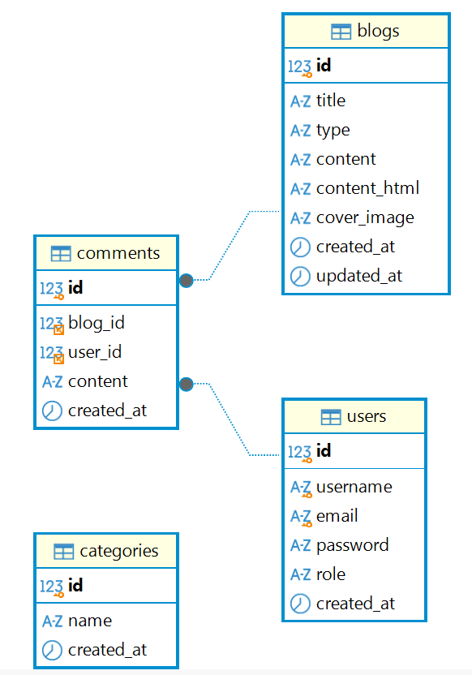

# Dissertation — Personal Blog Website

## 1. Project Overview

This dissertation project is a **personal blog website** designed to provide users with a simple platform for browsing, searching, and interacting with blog posts.

The same application is implemented using two different frontend frameworks:

- **Vue 3**
- **React**

Both implementations share the same backend API and MySQL database, allowing the two frontend frameworks to be compared while maintaining the same core functionality.

## 2. Features

The personal blog website provides the following main features:

1. Search blogs by title
2. Browse blogs by category
3. Create and publish blog posts
4. Edit blog posts
5. Delete blog posts
6. User registration and login
7. Post comments
8. Role-based access control for admin functions

## 3. Frontend

### 3.1 Vue Implementation

**Project:** `project_vue`

Technology stack:

- Vue 3
- Vite
- Bootstrap
- Tailwind CSS
- Sass / SCSS
- Pinia for global state management
- Vue Router for routing

Pinia is used to manage global user information, authentication state, user roles, and login status.

### 3.2 React Implementation

**Project:** `project_react`

Technology stack:

- React
- JSX
- Vite
- Bootstrap
- Tailwind CSS
- Sass / SCSS
- Context API for global state management
- React Router for routing

The React version reproduces the same core functionality as the Vue version while using React-specific approaches for component management, state management, and routing.

## 4. Backend

The backend provides the RESTful API used by both frontend implementations.

Technology stack:

- Node.js
- Express.js
- JWT for authentication
- bcrypt for password hashing
- RESTful API

### 4.1 Authentication and Authorisation

The backend implements:

- User registration
- User login
- JWT-based authentication
- Password hashing with bcrypt
- Authentication middleware
- Admin authorisation middleware
- Role-based access control

Admin-only operations include:

- Creating blog posts
- Editing blog posts
- Deleting blog posts

The backend validates the user's authentication and role before allowing protected operations.

## 5. Database

**Database:** MySQL

**Database management tool:** DBeaver

### 5.1 Database Tables
 `users` - Stores user account information
 - role: admin & visitor

 `blogs` - Stores blog post information

`categories` - Stores the available blog categories.

`comments` - Stores comments associated with blog posts and users.

### 5.2 Database Entity Relationship Diagram
